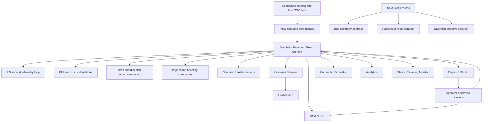
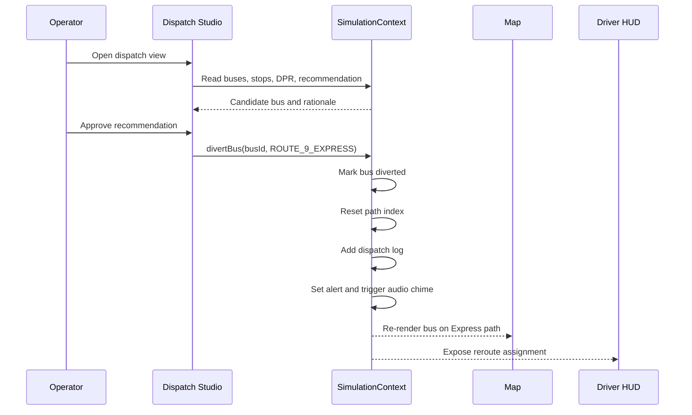
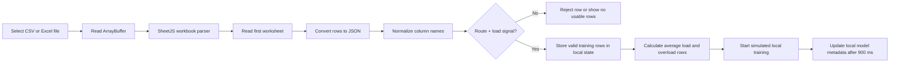
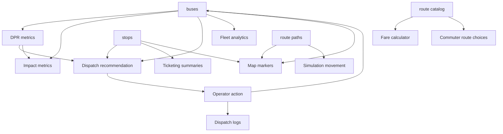
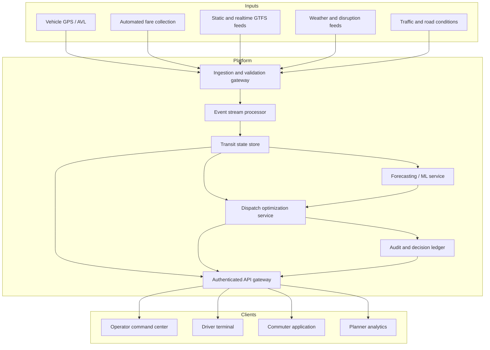

# BRTS-Pulse: Complete Technical Project Report

**Project:** BRTS-Pulse  
**Domain:** Ahmedabad Janmarg Bus Rapid Transit System (BRTS) operations  
**Application type:** Next.js web application and operational simulation prototype  
**Repository:** `brts-pulse`  
**Status:** Functional front-end prototype with local simulation, typed domain state, map visualization, analytics, and API contracts

> This report describes the implementation present in the repository. It distinguishes actual implemented behavior from production extensions that would still need to be built.

---

## 1. Executive Summary

BRTS-Pulse is a browser-based transit operations platform for visualizing and balancing passenger demand across Ahmedabad BRTS routes. Its central use case is a demand imbalance:

- Route 9 is modeled as overloaded, especially around RTO Circle, Gujarat University, and LD Engineering College.
- Route 12 is modeled as underutilized, with buses operating below the preferred passenger-load threshold.
- The system identifies available low-load buses on Route 12 and recommends diverting them to a Route 9 Express corridor.
- Operators can inspect the recommendation, approve a diversion, see the bus move on a map, and review economic and passenger-impact estimates.

The application also provides:

- A command center for fleet telemetry and map operations.
- A dispatch and diversion studio.
- A commuter route and fare experience.
- A driver HUD with reroute alerts.
- Fleet and financial analytics.
- Route and fare reference tools.
- Ticketing and station-rush monitoring components.
- Controlled disruption scenarios for peak surge, station closure, and monsoon delay.
- Local CSV/Excel upload and simulated local-model training state.
- API endpoints that expose bus telemetry, diversion directives, and passenger route options.

The current implementation is self-contained. It uses seeded TypeScript data and an in-browser timer rather than a live vehicle feed, persistent database, trained machine-learning model, or external optimization service.

---

## 2. Project Objectives

### 2.1 Primary objective

Demonstrate how an urban transit operator can rebalance capacity by reallocating underused buses toward overloaded corridors instead of adding vehicles to the fleet.

### 2.2 Operational objectives

- Detect bus overload using Passenger Load Factor (PLF).
- Detect underutilized buses using a low-load threshold.
- Monitor station waiting passengers and ticket activity.
- Calculate a transparent diversion profitability ratio.
- Recommend a candidate bus and target corridor.
- Keep the final dispatch action under operator control.
- Provide driver-facing reroute information.
- Show passenger-facing route alternatives.
- Quantify estimated passenger, financial, fuel, emissions, balance, and resilience outcomes.

### 2.3 Demonstration objective

Provide a single browser experience in which the full operational loop can be demonstrated:

```text
Observe demand -> Detect imbalance -> Calculate benefit -> Recommend diversion
       -> Operator approval -> Driver alert -> Vehicle reroute -> Measure impact
```

---

## 3. What the Project Is and Is Not

### 3.1 What it is

- A Next.js 16 App Router application.
- A typed React simulation of BRTS fleet and station operations.
- A multi-role operational interface.
- A map-based visualization of route paths, stops, and buses.
- A transparent rule-based dispatch decision-support prototype.
- A demonstration API surface with GTFS-Realtime-shaped bus data.

### 3.2 What it is not yet

- It is not connected to live Ahmedabad BRTS AVL, AFC, GPS, or traffic systems.
- It does not contain a database.
- It does not persist dispatch actions between server restarts or browser reloads.
- It does not call an external AI/ML model.
- The `trainLocalModel` function changes local model metadata after a timeout; it does not train a statistical or neural model.
- The API route responses do not mutate the shared browser simulation state.
- The emissions and economic results are estimates based on explicit proxies, not audited operational measurements.
- Authentication, authorization, operator identity, audit persistence, and production security controls are not implemented.

---

## 4. Users and Stakeholders

### 4.1 Control-room operator

Uses the Command Center and Dispatch Studio to:

- Monitor the active fleet.
- Filter overloaded, diverted, or route-specific vehicles.
- Inspect bus positions and load state.
- Review generated dispatch recommendations.
- Approve a diversion.
- Run resilience scenarios.
- Review dispatch logs and impact metrics.

### 4.2 Driver

Uses the Driver HUD to:

- Select the assigned bus terminal.
- View speed, passenger count, PLF, next stop, heading, and corridor.
- Receive a visible reroute alert.
- Hear a synthesized audio chime.
- Accept a Route 9 Express diversion.

### 4.3 Commuter

Uses the Commuter Simulator to:

- Select an origin and destination.
- Compare a direct route with a lower-load transfer plan.
- See route, crowding, fare, and journey guidance.
- Generate a demonstration ticket identifier.

### 4.4 Transit planner or analyst

Uses Analytics, Routes & Fares, and Scenario Lab to:

- Compare corridor utilization.
- Inspect route-level fleet coverage.
- Review PLF curves and financial breakdowns.
- Export fleet data as CSV.
- Test peak, closure, and weather disruption assumptions.

---

## 5. Product Surface and Routes

The root page redirects to `/command-center`.

| URL | Page | Purpose |
|---|---|---|
| `/` | Home redirect | Redirects to the Command Center |
| `/command-center` | Command Center | Fleet KPIs, interactive map, telemetry list, scenarios |
| `/dispatch-engine` | Dispatch Studio | DPR recommendation, diversion controls, training upload, scenarios |
| `/commuter` | Commuter Simulator | Origin/destination route selection and fare/crowding choices |
| `/driver-hud` | Driver Cockpit HUD | Driver telemetry and reroute alert workflow |
| `/analytics` | Route Analytics | Fleet intelligence, charts, heatmap, OD matrix, financial views |
| `/routes` | Routes & Fares | Published route directory and distance-based fare calculator |
| `/dashboard` | Alias | Re-exports the Command Center page |
| `/dispatch` | Alias | Re-exports the Dispatch Studio page |
| `/driver` | Alias | Re-exports the Driver HUD page |

### Shared navigation

`Navbar.tsx` provides:

- BRTS-Pulse branding.
- Navigation links for all primary views.
- Simulation live/paused control.
- Ahmedabad weather display with a fixed demand multiplier of `1.2`.
- Current local time in IST format.
- Reset simulation control.
- Last-action alert banner.

---

## 6. High-Level Architecture



### Layered view

```text
Presentation layer
  Next.js pages, shared Navbar, dashboards, forms, tables, charts, map, driver HUD

State and orchestration layer
  SimulationContext.tsx
  React state, derived metrics, simulation timer, scenario actions, dispatch actions

Domain layer
  brts.ts interfaces and union types
  route catalog, route geometry, fare calculation

Data layer
  initialDataset.ts
  routeCatalog.ts
  routePaths.ts
  route and fare CSV files

API layer
  /api/v1/buses
  /api/v1/dispatch/divert
  /api/v1/passengers/routes

External browser capabilities
  Leaflet map tiles
  Web Audio API
  File ArrayBuffer API and SheetJS parsing
```

---

## 7. Repository Structure

```text
BRTS/
├── AGENTS.md                    Next.js repository instructions
├── CLAUDE.md                    References AGENTS.md
├── package.json                 Dependencies and scripts
├── package-lock.json            Locked npm dependency tree
├── next-env.d.ts                Next.js TypeScript environment declarations
├── postcss.config.mjs           PostCSS configuration
├── tailwind.config.ts           Tailwind theme and utility configuration
├── tsconfig.json                TypeScript compiler configuration
├── PROJECT_REPORT.md            This technical report
└── src/
    ├── app/
    │   ├── layout.tsx
    │   ├── page.tsx
    │   ├── globals.css
    │   ├── command-center/page.tsx
    │   ├── dispatch-engine/page.tsx
    │   ├── commuter/page.tsx
    │   ├── driver-hud/page.tsx
    │   ├── analytics/page.tsx
    │   ├── routes/page.tsx
    │   ├── dashboard/page.tsx
    │   ├── dispatch/page.tsx
    │   ├── driver/page.tsx
    │   └── api/v1/
    │       ├── buses/route.ts
    │       ├── dispatch/divert/route.ts
    │       └── passengers/routes/route.ts
    ├── components/
    │   ├── Navbar.tsx
    │   ├── Map/
    │   ├── Analytics/
    │   └── Routes/
    ├── context/
    │   └── SimulationContext.tsx
    ├── data/
    │   ├── initialDataset.ts
    │   ├── routeCatalog.ts
    │   ├── routePaths.ts
    │   └── Routes/*.csv
    └── types/
        └── brts.ts
```

---

## 8. Technology Stack

### Runtime and framework

- Node.js/npm project.
- Next.js `^16.3.5`.
- React `^19.0.0`.
- TypeScript `^5.7.3`.
- App Router under `src/app`.

### UI and styling

- Tailwind CSS `^3.4.17`.
- PostCSS and Autoprefixer.
- Inter and JetBrains Mono via `next/font/google`.
- Custom BRTS palette based on blue, orange, green, and neutral glass surfaces.
- Responsive layouts with Tailwind breakpoints.

### Visualization and interaction

- Leaflet `^1.9.4`.
- React Leaflet `^5.0.0`.
- Recharts `^2.15.1`.
- Lucide React icons.
- Framer Motion is installed for UI motion support.
- Web Audio API generates the reroute chime.

### Data and file processing

- SheetJS `xlsx` parses uploaded CSV and Excel workbooks.
- No ORM, database driver, cloud SDK, authentication package, or ML package is present.

### Scripts

```text
npm run dev       Start the Next.js development server
npm run build     Create a production build
npm run start     Start the production server
npm run lint      Run the configured Next lint command
```

---

## 9. Application Bootstrap

`src/app/layout.tsx` is the root layout.

Execution sequence:

1. Load Inter and JetBrains Mono font variables.
2. Load global CSS and Leaflet styles.
3. Render `SimulationProvider` around the application.
4. Render the persistent `Navbar`.
5. Render the active page under the main content area.
6. Redirect `/` to `/command-center`.

The `SimulationProvider` means all client pages rendered in the same browser tree access the same current simulation state.

---

## 10. Domain Data Model

The central domain types are defined in `src/types/brts.ts`.

### 10.1 Bus

A `Bus` contains:

- Identifier and registration number.
- Route ID and route name.
- Current stop.
- Latitude, longitude, heading, and speed.
- Capacity and current passenger count.
- Calculated PLF percentage.
- Operational status.
- Diversion flag and optional target route.
- Optional path index for movement along route geometry.

Valid bus statuses:

```text
CRITICAL_OVERLOAD
OVERLOAD
NEAR_CAPACITY
UNDERUTILIZED
LOW_RUSH
```

### 10.2 BRTS stop

A `BRTSStop` contains:

- Stop ID and name.
- Geographic position.
- Route association.
- Tickets sold during the last hour.
- Waiting passengers.
- Rush classification.

Valid rush levels:

```text
CRITICAL_SURGE
HIGH_RUSH
MODERATE_RUSH
LOW_RUSH
```

### 10.3 Route and fare types

`BRTSRoute` stores route number, endpoints, stop count, intermediate stops, and fare range.

`FareSlab` stores distance range and fare.

The configured distance fare slabs are:

| Distance | Fare |
|---|---:|
| 0.0-2.0 km | Rs 5 |
| 2.1-5.0 km | Rs 10 |
| 5.1-8.0 km | Rs 15 |
| 8.1-12.0 km | Rs 20 |
| 12.1-16.0 km | Rs 25 |
| 16.1-20.0 km | Rs 30 |
| Above 20.0 km | Rs 35 |

### 10.4 Dispatch and impact types

The model also defines:

- `DPRMetrics`: benefit, cost, ratio, saved time, and waiting passengers.
- `DispatchRecommendation`: title, action, rationale, confidence, priority, and candidate bus.
- `DispatchLog`: action history and reported benefit.
- `RouteFleetOptimization`: Route 12 fleet sizing and excess-bus analysis.
- `LocalModelState`: simulated model version, training count, feature count, and upload details.
- `TransitImpactMetrics`: passenger time, fuel, CO2, balance, resilience, overload, and low-load outputs.
- `TransitScenario` and `ActiveScenario`: controlled disruption state.

---

## 11. Seeded Data and Network Scope

### 11.1 Fleet

`initialDataset.ts` begins with explicit demonstration vehicles:

- Route 9 buses with high and critical loads.
- Route 12 buses with low or underutilized loads.
- Two seeded Route 12 buses already marked as diverted to Route 9 Express.

The file then generates two deterministic demonstration buses for every published route that did not already have an explicit bus. This allows analytics to display the broader route catalog, not only the two central corridors.

All generated buses have:

- Capacity of 70 seats.
- Deterministic passenger values.
- Derived PLF and status.
- A route geometry position.
- A generated vehicle ID and registration number.

### 11.2 Stops

The explicit Ahmedabad stop set includes 14 stops, from RTO Circle through Route 9, Route 12, LD Engineering College, Maninagar Railway Station, and CTM Cross Road.

Each stop has seeded ticket volume, waiting passengers, and rush level.

### 11.3 Routes

`routeCatalog.ts` contains published route definitions for:

```text
1, 2, 3, 4, 5, 6, 7, 8, 9, 11, 12, 14, 15, 16, 17, 18, 101, 201
```

The project focuses operationally on:

- Route 9: the high-demand corridor.
- Route 12: the low-demand source corridor.
- Route 9 Express: the dynamic diversion path.

### 11.4 Geographic paths

`routePaths.ts` stores coordinate arrays for route polylines. Several bridge waypoints are explicitly included to avoid drawing straight-line paths across the Sabarmati River.

The map also includes:

- Ahmedabad BRTS corridor view.
- Entire India view.
- Google roadmap tile option.
- Google satellite tile option.
- CARTO dark tile option.

The Google and CARTO API keys are read from environment variables, but the fallback tile URLs are also configured.

---

## 12. Simulation Engine

The simulation engine is implemented in `SimulationContext.tsx`.

### 12.1 State owned by the provider

The provider owns:

- `buses`
- `stops`
- `isSimulating`
- `dispatchLogs`
- `wSaved`
- `fuelCost`
- `lastAlert`
- `weatherFactor`
- `activeScenario`
- `localModel`

It derives:

- DPR metrics.
- Transit impact metrics.
- Dispatch recommendation.
- Route ticketing summaries.
- Total tickets and revenue.

### 12.2 Timer loop

When simulation is active, a `setInterval` runs every 2.5 seconds.

For each bus:

1. Select the normal route path or Route 9 Express path if diverted.
2. Read the current path index.
3. Select the next path coordinate.
4. Move latitude and longitude 18% toward the target.
5. Snap to the target when the remaining coordinate distance is below `0.002`.
6. Update path index and heading.
7. Add a random passenger delta between `-2` and `+3`.
8. Clamp passengers between 5 and 95.
9. Recalculate PLF.
10. Recalculate status from PLF.

Status thresholds in the timer are:

```text
PLF > 110%       CRITICAL_OVERLOAD
PLF >= 100%      OVERLOAD
PLF >= 85%       NEAR_CAPACITY
PLF >= 30%       LOW_RUSH
Otherwise        UNDERUTILIZED
```

For each stop:

1. Determine whether the stop is high or critical rush.
2. Increase tickets faster at high-rush stops.
3. Change waiting passengers using a small random delta.
4. Recalculate rush level from waiting passengers.

Stop rush thresholds are:

```text
Waiting > 100    CRITICAL_SURGE
Waiting > 60     HIGH_RUSH
Waiting > 25     MODERATE_RUSH
Otherwise        LOW_RUSH
```

The timer is cleared when simulation is paused or the provider is unmounted.

---

## 13. Dynamic Passenger Redistribution Algorithm

The project refers to this as DPR in its types and interface labels.

### 13.1 Inputs

- Route 9 bus passenger loads.
- Bus capacities.
- Configurable minutes saved per passenger.
- Configurable deadhead fuel cost.
- A fixed Route 12 delay cost.

Default parameters:

```text
Minutes saved per passenger = 14
Deadhead fuel cost          = Rs 450
Route 12 delay cost         = Rs 320
Passenger time value        = Rs 2.5 per passenger-minute
```

### 13.2 Calculation

For Route 9:

```text
Overload passengers = sum(max(0, currentPassengers - capacity))
Waiting estimate    = 320 + overload passengers * 2.5
```

Economic calculation:

```text
Gross benefit = minutes saved * waiting passengers * Rs 2.5
Total costs   = deadhead fuel cost + Route 12 delay cost
Net benefit   = round(gross benefit - total costs)
DPR ratio     = round(gross benefit / total costs, 2)
```

The recommendation is economically eligible when:

```text
Net benefit > 0
```

### 13.3 Recommendation rules

The recommendation derives three possible states.

#### High-priority diversion

Generated when all are true:

- At least one bus is overloaded or critically overloaded.
- At least one non-diverted Route 12 bus has PLF below 35%.
- DPR is economically recommended.

The first available Route 12 candidate is selected, and the action targets Route 9 Express.

Confidence is calculated as:

```text
min(98, 72 + overloaded bus count * 4 + available bus count * 3)
```

#### Medium-priority monitoring

Generated when overloaded buses exist but no qualifying low-load Route 12 bus is available.

#### Low-priority schedule maintenance

Generated when there is no active overload condition.

### 13.4 Fleet sizing calculation

The fleet optimization monitor uses a preferred target of 52 passengers per bus, representing approximately 75% of a 70-seat bus.

```text
Required Route 12 buses = max(1, ceil(total Route 12 passengers / 52))
Excess buses             = max(0, active non-diverted buses - required buses)
Candidate buses          = non-diverted buses with PLF < 35%
```

---

## 14. Diversion Workflow

The diversion can be initiated from several surfaces.

### Operator workflow



### In-context `divertBus` behavior

1. Locate the requested bus.
2. Set `isDiverted` to `true`.
3. Set `divertedTo` to the target route.
4. Set the temporary status to `UNDERUTILIZED`.
5. Reset `pathIndex` to zero.
6. Create a dispatch log using current bus and DPR values.
7. Add the log to the front of the dispatch log list.
8. Set the last alert message.
9. Trigger a D5-to-A5 Web Audio chime.

`autoDivertEmptyBuses()` calls the same function for `BUS-1201` and `BUS-1205`.

### Reset behavior

`resetSimulation()` restores the seeded buses and stops, clears active scenarios, and sets a reset alert. It does not reset every other value, such as the existing dispatch log history or configurable DPR parameters.

---

## 15. Page-by-Page Functionality

### 15.1 Command Center

File: `src/app/command-center/page.tsx`

Main features:

- Active fleet count.
- Overloaded bus count.
- Active diversion count.
- Average fleet PLF.
- DPR recommendation status.
- Route reference panel.
- Transit impact panel.
- Scenario Lab.
- Interactive Leaflet map.
- Searchable bus telemetry sidebar.
- Filters for all, overload, diverted, Route 9, and Route 12.
- Bus selection and map popup details.
- Divert action from selected bus context.

This is the default operational landing page.

### 15.2 Dispatch Studio

File: `src/app/dispatch-engine/page.tsx`

Main features:

- Dynamic diversion approval button.
- Route reference panel.
- Impact ledger.
- Resilience Scenario Lab.
- Live AI-assisted recommendation label. The current implementation is a deterministic rule engine, not an external AI model.
- Recommendation priority and confidence display.
- Apply recommendation action.
- Configurable DPR values.
- CSV and Excel upload through SheetJS.
- Validation for route and load-related columns.
- Uploaded load average and overload analysis.
- Training template download.
- Local-model metadata and simulated training process.
- Dispatch logs.

Accepted uploaded signal names include normalized variants of:

```text
route, routeId, corridor
passengers, currentPassengers, plf, plfPercent, waitingPassengers
```

The upload parser rejects rows without both a route signal and a load signal.

### 15.3 Commuter Simulator

File: `src/app/commuter/page.tsx`

Main features:

- Origin and destination selectors.
- Route catalog-derived station list.
- Direct and transfer journey options.
- Live dependency on diverted bus count.
- Route 12 plus Express 9X comfort journey when an express bus is active.
- Direct Route 3 journey when no express bus is active.
- Fare labels derived from route catalog values.
- Suggested journey sequence.
- Demonstration ticket ID generation in the form `BRTS-2026-######`.

The local page currently calculates route choices from the shared state. The separate passenger API exposes a similar route-choice contract with fixed duration, crowding, PLF, fare, and discount values.

### 15.4 Driver HUD

File: `src/app/driver-hud/page.tsx`

Main features:

- Driver bus selector.
- Current assignment display.
- Speedometer.
- Passenger capacity meter.
- PLF status.
- Current stop and heading.
- Route/corridor display.
- Reroute alert modal for a Route 12 vehicle.
- Accept reroute action.
- Audio chime test.

A selected non-diverted Route 12 bus opens the reroute alert modal by default. Accepting the action calls the same shared `divertBus` function used by operator controls.

### 15.5 Analytics

File: `src/app/analytics/page.tsx`

Main features:

- Fleet average load.
- Vacant seat count.
- Over-capacity count.
- Active diversions.
- Fleet search.
- Route and status filters.
- Sort by load, speed, or route.
- Fleet CSV export.
- Complete network route coverage table.
- Hourly passenger load curves.
- Financial ROI breakdown.
- Segment congestion heatmap matrix.
- Origin-destination flow matrix.
- Route reference panel.
- Transit impact panel.

Some chart matrices are static demonstration arrays in the page, while fleet metrics and financial values are derived from current simulation state.

### 15.6 Routes & Fares

File: `src/app/routes/page.tsx`

Main features:

- Search route number, name, endpoint, or landmark.
- Route directory table.
- Total stop count.
- Intermediate stop list.
- Fare range.
- Distance slider.
- Fare slab selection using `fareForDistance`.
- Full fare slab reference.

### 15.7 Station Ticketing Monitor

File: `src/components/Analytics/StationTicketingMonitor.tsx`

This component provides:

- All-station, surge-only, and low-rush filters.
- Total tickets sold during the modeled hour.
- Revenue using a flat Rs 15 ticket value.
- Route 9 versus Route 12 demand balance.
- Station rush badges.
- Waiting passenger display.
- Station ticketing grid.

The component is implemented as a reusable monitor and is available for integration into an operational page.

### 15.8 Fleet Optimization Monitor

File: `src/components/Analytics/FleetOptimizationMonitor.tsx`

This component provides:

- Route 12 passenger total.
- Route 12 average PLF.
- Required bus count.
- Excess bus count.
- Underutilized candidate bus list.
- Reallocation controls.
- Stated DPR impact display.

It is a specialized view of the same shared fleet state and dispatch actions.

### 15.9 Scenario Lab

File: `src/components/Analytics/ScenarioLab.tsx`

Supported scenarios:

1. `PEAK_SURGE`: increases Route 9 passenger load and raises related stop waiting counts.
2. `STATION_CLOSURE`: reduces waiting at `STOP-06`, representing LD College closure and passenger redistribution.
3. `MONSOON_DELAY`: reduces bus speed by 30% with a minimum of 10 km/h and increases stop waiting passengers.

Each scenario:

- Sets `activeScenario` metadata.
- Mutates bus and stop state.
- Recalculates downstream recommendations and impact metrics.
- Can be cleared by restoring the seeded baseline.

---

## 16. Map Architecture and Behavior

### 16.1 SSR boundary

`BusMap.tsx` dynamically imports `LeafletMapWrapper` with server-side rendering disabled. This avoids SSR issues from browser-only Leaflet APIs.

### 16.2 Map objects

The map renders:

- All configured route polylines.
- Emphasized Route 9 and Route 12 paths.
- Route 9 Express path.
- Station markers.
- Bus markers.
- Selected-bus popup details.
- Current route progress.
- Diversion origin and destination details.

### 16.3 Bus icon semantics

- Red/orange emphasis for overloaded buses.
- Amber emphasis for diverted buses.
- Green emphasis for underutilized buses.
- Heading rotation based on current movement vector.
- PLF shown with the vehicle identifier.

### 16.4 Station icon semantics

The map identifies special stations such as:

- RTO Circle as origin.
- LD College and CTM as terminals.
- Nehrunagar as a hub.
- Maninagar as a railway-related stop.

### 16.5 Map providers

The provider selector changes tile URL and attribution between Google roadmap, Google satellite, and CARTO. The route geometry and operational markers remain application-controlled.

---

## 17. Ticketing and Revenue Logic

The simulation derives ticketing summaries from stop counters.

- Route 9 includes Route 9 stops and shared stops.
- Route 12 includes Route 12 stops.
- Each ticket is valued at `Rs 15` in the shared simulation context.
- Total revenue is calculated as total tickets multiplied by Rs 15.
- High-rush stops receive larger ticket increments during each timer cycle.

The model does not integrate an actual AFC machine, QR gateway, smart-card processor, or financial ledger.

---

## 18. Commuter Route Logic

The commuter view uses route catalog data and the shared fleet state.

### Direct route

- Uses Route 3 as the direct route reference.
- Uses the route maximum fare.
- Uses a fixed demonstration duration of 18 minutes in the API contract.

### Comfort/transfer route

- Uses Route 12 as the initial corridor.
- Transfers at Nehrunagar Circle.
- Continues on Express 9X.
- Uses a reduced transfer fare calculated as 67% of Route 12 maximum fare in the API contract.
- Is selected automatically when at least one diverted bus is active.

The route search normalizes station names by removing terms such as `BRTS`, `station`, `engineering`, `college`, `road`, and punctuation before comparing them.

---

## 19. Local Upload and Training Workflow

The Dispatch Studio accepts a CSV or Excel file.



Training metadata includes:

- Status: `READY` or `TRAINING`.
- Version string.
- Training example count.
- Fixed feature count of 8.
- Training time.
- Source file name.
- Uploaded row count.

Important limitation: no model fitting, feature transformation, validation split, inference model, or persisted artifact is implemented.

---

## 20. API Documentation

### 20.1 GET `/api/v1/buses`

Purpose: return seeded fleet data and a GTFS-Realtime-shaped payload.

Response includes:

- Status.
- ISO timestamp.
- Total bus count.
- Raw bus objects.
- `gtfsRt.header` with version `2.0`, full-dataset incrementality, and Unix timestamp.
- One entity per bus.

Each entity contains:

- Trip ID.
- Route ID, changed to `ROUTE_9_EXPRESS` when the bus is marked diverted.
- Latitude and longitude.
- Bearing.
- Speed converted from km/h to m/s.
- Current stop sequence set to 4.
- Transit status `IN_TRANSIT_TO`.
- Vehicle ID and label.

The handler reads `INITIAL_BUSES` directly. It does not read the live React context.

### 20.2 POST `/api/v1/dispatch/divert`

Request body:

```json
{
  "busId": "BUS-1201",
  "sourceRoute": "ROUTE_12",
  "targetRoute": "ROUTE_9_EXPRESS"
}
```

Validation:

- Missing `busId` returns HTTP 400.
- Invalid JSON returns HTTP 400.
- Missing target defaults to `ROUTE_9_EXPRESS`.

Success response includes:

- Status.
- Human-readable message.
- Bus ID.
- Source and target routes.
- Nehrunagar Circle effective junction.
- Estimated 14-minute wait saving.
- DPR ratio `3.4`.
- Net benefit `Rs 4,820`.
- Route 9 Express driver instruction.

The endpoint returns a directive but does not persist the diversion.

### 20.3 GET `/api/v1/passengers/routes`

Query parameters:

- `origin`.
- `destination`.

Defaults:

- Origin: `RTO Circle BRTS`.
- Destination: `LD Engineering College`.

Response provides two demonstration choices:

1. Fastest direct route.
2. Comfort route using Route 12 and Express 9X.

The response includes duration, crowd level, PLF, fare, warning/discount information, and transfer guidance.

---

## 21. Data Flow Diagrams

### 21.1 Operational control flow

```text
[Seeded buses and stops]
          |
          v
[Simulation timer every 2.5 seconds]
          |
          +--> Move buses along route coordinate arrays
          +--> Change passenger counts and PLF
          +--> Update stop tickets and waiting passengers
          |
          v
[Derived operational state]
          |
          +--> Overload detection
          +--> Underutilized-bus detection
          +--> Station surge detection
          +--> Ticketing totals
          |
          v
[DPR formula and recommendation rules]
          |
          v
[Operator decision]
          |
          +--> Keep schedule
          +--> Monitor reserve
          +--> Divert selected bus
                         |
                         v
                 [Route 9 Express path]
                         |
                         v
               [Impact metrics and logs]
```

### 21.2 State dependency graph



### 21.3 Scenario flow

```text
Select scenario
      |
      v
Update activeScenario metadata
      |
      +--> Modify Route 9 loads
      +--> Modify station waiting counts
      +--> Modify vehicle speeds
      |
      v
Recompute recommendation and impact metrics
      |
      v
Show live-test state across command and dispatch views
      |
      v
Restore baseline when scenario is cleared
```

### 21.4 Passenger decision flow

```text
Select origin and destination
             |
             v
Normalize station names
             |
             v
Check direct route match
             |
             v
Check active Express 9X buses
             |
       +-----+-----+
       |           |
 Express active  No express active
       |           |
       v           v
Route 12 + 9X   Direct corridor
       |           |
       +-----+-----+
             |
             v
Display plan, crowding, fare, and journey steps
```

---

## 22. Formula and Threshold Reference

| Metric | Implementation |
|---|---|
| PLF | `(currentPassengers / capacity) * 100` |
| Critical overload | PLF greater than 110% in timer logic |
| Overload | PLF at least 100% |
| Near capacity | PLF at least 85% and below 100% |
| Low rush | PLF at least 30% and below 85% |
| Underutilized | PLF below 30% in timer logic; candidate threshold below 35% in recommendation logic |
| High station rush | Waiting passengers greater than 60 |
| Critical station surge | Waiting passengers greater than 100 |
| Gross DPR benefit | Saved minutes × waiting passengers × Rs 2.5 |
| DPR costs | Deadhead cost + Rs 320 Route 12 delay cost |
| DPR ratio | Gross benefit / total costs, rounded to two decimals |
| Ticket revenue | Tickets × Rs 15 |
| Fuel avoided estimate | Diversions × 4.8 liters |
| CO2 avoided estimate | Avoided fuel liters × 2.68 kg |
| Network balance | `100 - abs(Route 9 average PLF - Route 12 average PLF) × 0.7`, clamped 0-100 |
| Resilience score | `72 - overloaded × 8 + low-load × 5 + diversions × 4`, clamped 0-100 |
| Required Route 12 buses | `max(1, ceil(total passengers / 52))` |

### Important threshold distinction

The code uses both:

- `PLF < 30%` when deriving the `UNDERUTILIZED` status during simulation.
- `PLF < 35%` when selecting dispatch candidates and low-load buses.

This is intentional in the current implementation but should be unified or documented as separate operational and dispatch thresholds in a production system.

---

## 23. Styling and Design System

`globals.css` establishes:

- Global font variables.
- BRTS blue, orange, green, silver, ink, and muted colors.
- Light glass-card surfaces.
- Responsive page background gradients.
- Leaflet map styling.
- Popup styling.
- Scrollbars.
- Overload and diversion pulse animations.
- Compatibility overrides for earlier dark utility classes.

`tailwind.config.ts` adds:

- `obsidian` colors.
- `transit` semantic colors.
- Custom font families.
- Glow shadows.
- Pulse animations.

The visual language combines:

- Operations-center terminology.
- High-visibility status colors.
- Compact telemetry tables.
- Map overlays.
- Glass-style panels.
- Monospaced metric labels.

---

## 24. Performance Characteristics

### Current strengths

- Most calculations are simple array reductions and filters.
- The simulation loop updates only the in-memory bus and stop arrays.
- Derived values use `useMemo` where appropriate.
- Leaflet is dynamically imported to protect server rendering.
- Route geometry is precomputed as static arrays.
- The browser can run the demonstration without backend infrastructure.

### Current limitations

- All buses and stops are held in one React Context, so every dependent view can re-render on each simulation tick.
- The map renders all route polylines and bus markers in the browser.
- Random simulation values make repeatable performance and behavior testing difficult.
- No server-side aggregation, event stream, cache, or pagination exists.
- The API returns the entire seeded fleet.
- The analytics page contains several static demonstration datasets.

### Production scaling direction

```text
Vehicle and AFC feeds
        |
        v
Ingestion gateway / message broker
        |
        v
Stream processor and state store
        |
        +--> Real-time API / WebSocket gateway
        +--> Optimization service
        +--> Historical analytics store
        |
        v
Role-based web clients
```

---

## 25. Security and Reliability Assessment

### Implemented safeguards

- TypeScript domain types.
- Basic malformed JSON handling in the diversion endpoint.
- Required `busId` validation.
- Browser-only map loading.
- Audio failure is caught and silently ignored.
- Uploaded file parsing is wrapped in error handling.

### Missing production controls

- Authentication and authorization.
- Role permissions for dispatch approval.
- Request schema validation library.
- Rate limiting.
- CSRF protection where applicable.
- API logging and audit persistence.
- Input size limits for uploads.
- File type and content security validation.
- Secrets management for map providers.
- Persistent transaction handling for diversions.
- Monitoring and alerting.
- Offline and reconnect behavior.
- Multi-user conflict resolution.

### Operational risks

1. **Simulation versus reality:** current behavior is not a live operational decision.
2. **Rule sensitivity:** fixed thresholds may create false positives or miss complex demand patterns.
3. **Data quality:** route, station, capacity, and passenger inputs require validation.
4. **Map provider dependency:** external map tiles can fail or impose usage limits.
5. **No rollback transaction:** a real dispatch system needs authorization, acknowledgement, cancellation, and audit state.
6. **Estimated benefits:** fuel, emissions, and time values require validated calibration.

---

## 26. Testing and Validation Plan

The repository does not contain a dedicated test suite. A production-quality validation plan should include:

### Unit tests

- Fare slab boundaries at 0, 2, 2.1, 5, 20, and above 20 km.
- PLF classification boundaries.
- Station rush classification boundaries.
- DPR calculations with zero and positive costs.
- Recommendation priority transitions.
- Route station normalization.
- Route 12 required-bus calculation.

### Component tests

- Command Center filters.
- Dispatch approval behavior.
- Scenario activation and clearing.
- Commuter route selection.
- Driver reroute modal.
- Spreadsheet validation.
- Fleet CSV export.

### API tests

- Missing `busId` returns 400.
- Invalid JSON returns 400.
- Default target route behavior.
- Bus payload shape.
- Passenger route query parameters.

### End-to-end tests

```text
Open command center
 -> observe overloaded and low-load buses
 -> open dispatch studio
 -> verify recommendation
 -> approve diversion
 -> verify map assignment and alert
 -> open driver HUD
 -> verify reroute state
 -> inspect analytics impact
```

### Data validation tests

- Ensure route catalog and route paths use compatible route IDs.
- Ensure every route displayed in analytics has geometry.
- Ensure every bus route can resolve a path.
- Ensure no stop has invalid rush state.
- Ensure CSV source rows match TypeScript route/fare constants.

---

## 27. Local Setup and Runbook

### Prerequisites

- Node.js with npm.
- Internet access if remote map tiles or Google fonts are needed.
- Optional map provider API keys:
  - `NEXT_PUBLIC_GOOGLE_MAPS_API_KEY`
  - `NEXT_PUBLIC_CARTO_API_KEY`

### Installation

```powershell
npm install
```

### Development

```powershell
npm run dev
```

Then open the local URL reported by Next.js, normally:

```text
http://localhost:3000
```

### Production build

```powershell
npm run build
npm run start
```

### Demonstration sequence

1. Open `/command-center`.
2. Inspect Route 9 overload and Route 12 low-load vehicles.
3. Select a bus on the map to inspect telemetry.
4. Open `/dispatch-engine`.
5. Review the DPR recommendation and impact ledger.
6. Run a peak surge or monsoon scenario.
7. Apply a recommended diversion.
8. Open `/driver-hud` and inspect the reroute assignment.
9. Open `/commuter` and compare the direct and transfer plans.
10. Open `/analytics` and export the fleet CSV.
11. Open `/routes` and test the fare calculator.
12. Use the reset button to restore the seeded fleet and stop state.

---

## 28. Current Implementation Gaps

### Data and backend

- Replace seeded state with live AVL, AFC, and station feeds.
- Add a database for vehicles, stops, routes, dispatches, users, and audit events.
- Make API actions update the authoritative state.
- Add real-time server-to-client updates.

### Optimization and intelligence

- Replace fixed rules with calibrated optimization or forecasting services.
- Train and evaluate a real model using historical route and station data.
- Add confidence calibration and explanation records.
- Add traffic, weather, road closure, accessibility, and driver constraints.

### Product and operations

- Add authenticated operator roles.
- Add approval workflow and dispatch acknowledgement.
- Add cancellation and rollback.
- Add notification delivery beyond browser audio.
- Add accessibility testing and keyboard-complete workflows.
- Add data-quality and health dashboards.

### Testing and delivery

- Add unit, component, API, and browser tests.
- Add CI build and lint validation.
- Add environment configuration documentation.
- Add observability and error reporting.

---

## 29. Recommended Production Architecture



Recommended production characteristics:

- PostgreSQL or another transactional store for authoritative state.
- Event broker for telemetry and dispatch events.
- WebSocket or Server-Sent Events for live clients.
- Schema validation at every ingestion boundary.
- Idempotent dispatch commands.
- Role-based authorization.
- Full audit history.
- Metrics for latency, feed freshness, recommendation acceptance, and passenger outcomes.

---

## 30. A-to-Z Capability Index

| Letter | Capability |
|---|---|
| A | Analytics, API routes, Ahmedabad BRTS focus, audio alerts |
| B | Bus telemetry, bus status, BRTS route catalog |
| C | Command Center, commuter route guidance, CSV export |
| D | Dynamic diversion, DPR calculation, driver HUD |
| E | Express 9X reroute, economic benefit estimate |
| F | Fleet optimization, fare slabs, filtering |
| G | Geographic map, GTFS-Realtime-shaped payload |
| H | Heading calculation, high-rush station detection |
| I | In-memory state, impact ledger, interactive map |
| J | Janmarg branding and Ahmedabad operational context |
| K | Key route and station references |
| L | Leaflet integration, load factor, local-model metadata |
| M | Map providers, movement simulation, monsoon scenario |
| N | Network balance score, navigation workflow |
| O | Operator approval, overload detection, OD matrix |
| P | Passenger Load Factor, passenger route API, peak surge |
| Q | Queue/waiting passenger indicators |
| R | Route catalog, route paths, rerouting, resilience lab |
| S | Station telemetry, scenario simulation, SheetJS upload |
| T | Ticketing counters, transit impact, TypeScript types |
| U | Underutilized bus detection, UI role views |
| V | Vehicle positions and vehicle registration labels |
| W | Web Audio API, weather factor, wait-time value |
| X | XLSX/CSV training import |
| Y | Year-stamped demonstration ticket IDs |
| Z | Zero external model/database dependency in the current prototype |

---

## 31. Final Assessment

BRTS-Pulse successfully demonstrates an end-to-end transit operations concept in a single web application. The strongest implemented path is the transparent reallocation workflow between overloaded Route 9 and underutilized Route 12:

```text
Seeded demand state
 -> Live browser simulation
 -> PLF and station-rush calculations
 -> DPR recommendation
 -> Operator approval
 -> Express 9X diversion
 -> Map, driver, commuter, analytics, and impact updates
```

Its architecture is appropriate for a hackathon prototype because it is easy to run, visually demonstrable, modular, and understandable. Its main production gap is not the user interface; it is the absence of authoritative live data, persistence, real model training, authentication, and operational-grade validation.

The correct next stage is to preserve the current UI and domain contracts while replacing the seeded simulation with validated live feeds, a persistent transit state service, a real dispatch command workflow, and measured evaluation against historical operational outcomes.
